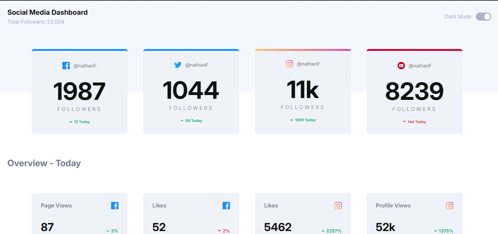
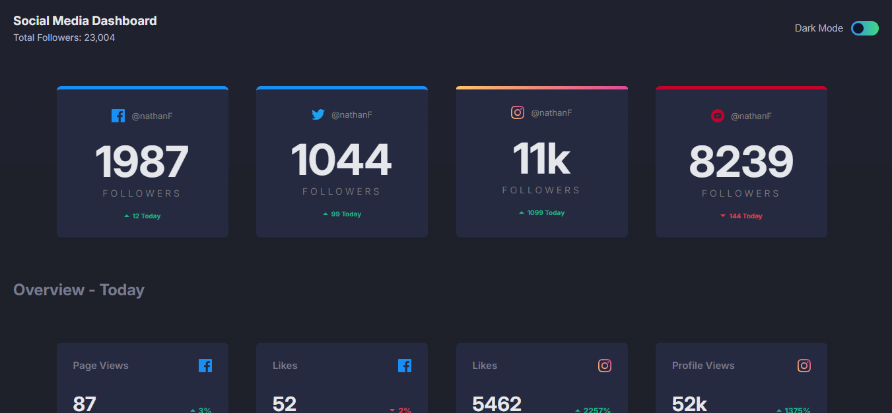

# Frontend Mentor - Social media dashboard with theme switcher solution

This is a solution to the [Social media dashboard with theme switcher challenge on Frontend Mentor](https://www.frontendmentor.io/challenges/social-media-dashboard-with-theme-switcher-6oY8ozp_H). Frontend Mentor challenges help you improve your coding skills by building realistic projects. 

## Table of contents

- [Overview](#overview)
  - [The challenge](#the-challenge)
  - [Screenshot](#screenshot)
  - [Links](#links)
- [My process](#my-process)
  - [Built with](#built-with)
  - [What I learned](#what-i-learned)
  - [Continued development](#continued-development)
- [Author](#author)

## Overview

### The challenge

Users should be able to:

- View the optimal layout for the site depending on their device's screen size
- See hover states for all interactive elements on the page
- Toggle color theme to their preference

### Screenshot





### Links

- Live Site URL: [Social-media-dashboard.com](https://wizdev0.github.io/Social-media-dashboard/)

## My process

### Built with

- Semantic HTML5 markup
- CSS custom properties
- Flexbox
- CSS Grid
- JavaScript


### What I learned

I learnt a lot, which includes:
- How to make a toggle button
- How to switch the theme of a page with javaScript
- How to effectively use grid
- How to make the theme not change after the page reloads

```html
<section class="header">

        <div class="head-words">
            <h3 class="head-h3">
                Social Media Dashboard
            </h3>

            <p class="head-p">
                Total Followers: 23,004
            </p>

        </div>

        <div class="mobile-border"></div>

        <div class="theme-switch">
            <span class="theme-wrd">Dark Mode</span>

            <label class="switch">
                <input type="checkbox" id="theme-toggle">
                <span class="slider"></span>
            </label>
        </div>

    </section>
```
```css

/* THEME SWITCHER */
/* Theme colors */
body{
  background: linear-gradient(
    to bottom, 
    hsl(225, 100%, 98%) 30%,
    hsl(0, 100%, 100%) 30%

  )no-repeat;
  color: #111;
  transition: 0.3s;
}

body.dark{
  background: linear-gradient(
    to bottom, 
    hsl(232, 19%, 15%) 30%,
    hsl(230, 17%, 14%) 30%

  ) no-repeat;
  color: #e5e7eb;
  min-height: 100vh;
} 


/* Container */
.theme-switch {
  display: flex;
  align-items: center;
  gap: 12px;
  font-family: sans-serif;
}

/* Switch */
.switch {
  position: relative;
  width: 42px;
  height: 22px;
}

.switch input {
  opacity: 0;
  width: 0;
  height: 0;
}

/* Slider */
.slider {
  position: absolute;
  inset: 0;
  background: linear-gradient(
  to right,
  hsl(210, 78%, 56%),
  hsl(146, 68%, 55%)

  );
  border-radius: 999px;
  cursor: pointer;
  transition: 0.5;
}

/* Circle */
.slider::before {
  content: "";
  position: absolute;
  width: 16px;
  height: 16px;
  left: 3px;
  top: 3px;
  background: #0f172a;
  border-radius: 50%;
  transition: 0.5s;
}

/* Checked state */
.switch input:checked + .slider {
  background: hsl(230, 22%, 74%);
}

.switch input:checked + .slider:hover {
  background: linear-gradient(
  to right,
  hsl(210, 78%, 56%),
  hsl(146, 68%, 55%)
);
}

.switch input:checked + .slider::before {
  transform: translateX(20px);
  background-color: white;
}
```
```js
/* TOGGLE SWITCH TO DARK AND LIGHT MODE */
const toggle = document.getElementById("theme-toggle");

const savedTheme = localStorage.getItem("theme") || "light";
document.body.classList.add(savedTheme);
toggle.checked = savedTheme === "light";


toggle.addEventListener("change", () => {
   if (toggle.checked) {
    document.body.classList.remove("dark");
    document.body.classList.add("light");
    localStorage.setItem("theme", "light");
   } else {
    document.body.classList.remove("light");
    document.body.classList.add("dark");
    localStorage.setItem("theme", "dark")
   }
});
```

### Continued development

I hope to learn more about web development and also try to use grid effectively

## Author
- Frontend Mentor - [@Wizdev0](https://www.frontendmentor.io/profile/Wizdev0)
- Twitter - [@otutech](https://www.twitter.com/otutech)
